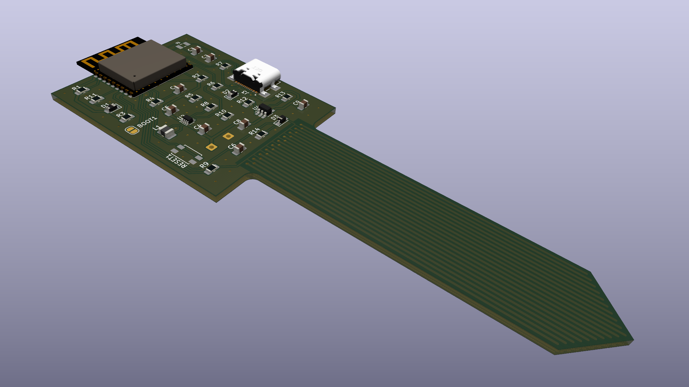
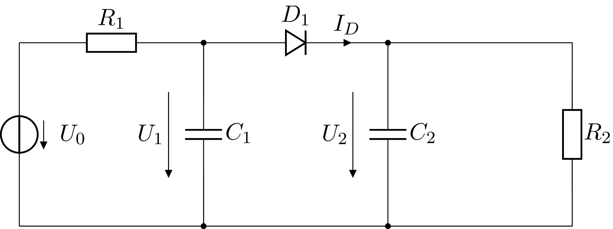

# Moisture sensor

A capacitive moisture sensor board employing an ESP32-C3 RISC-V microcontroller
capable of transmitting measurements via Wi-Fi and Bluetooth 5 (LE). The board
can be powered using USB-C, or a single cell LiPo battery. The battery is
charged when power is supplied to the USB-C port.

Components are spaced quite far apart, with the goal of making it easier to
solder them by hand.

## Sensor circuit

The sensor circuit consists of the following building blocks:
- The microcontroller generating a square wave, depicted as voltage source
  $U_0$.
- A low pass filter made up of resistor $R_1$ and capacitor $C_1$. Capacitor
  $C_1$ stands for sensor wires together with the medium to be measured acting
  as a dielectric. Its value is to be determined by the circuit.
- A peak voltage detector made up of diode $D_1$, resistor $R_2$ and capacitor
  $C_2$.
- The microcontroller measuring voltage $U_2$.

Since resistor $R_2$ is chosen to be quite large, the impact of the peak voltage
detector on the low pass filter becomes negligible, as soon as $C_2$ reaches a
stable voltage. Just considering the voltage source together with the low pass
filter leads to a peak voltage of

$$ U_p = U_+ \frac{1 - e^{-\omega T D}}{1 - e^{-\omega T}}, $$

where $U_+$ is the high voltage of the voltage source, $T$ the period, $D$ the
duty cycle, and $\omega = 1/(R_1 C_2)$. The peak voltage has a range from $U_+$
for zero $C_2$ down to $D U_+$ for infinite $C_2$.

## Possible future circuit improvements

- Add battery protection circuit.
- Add a switch for turning the device on and off.
- Add a button to put the device into a mode where it acts as an access point or
  can be connected via Bluetooth.
- Make it possible for the microcontroller to measure battery voltage and to
  know if it is powered using USB or the battery. Detect USB using an RTC GPIO
  port to be able to wake the microcontroller when plugged in.
- Replace the battery solder pads with a connector.
- Remove sensing traces from the top so that it matters less how deep the sensor
  is pushed into the soil. Additionally, moisture variations are more relevant
  deeper down than on the top.
- Increase the length of the probe.
